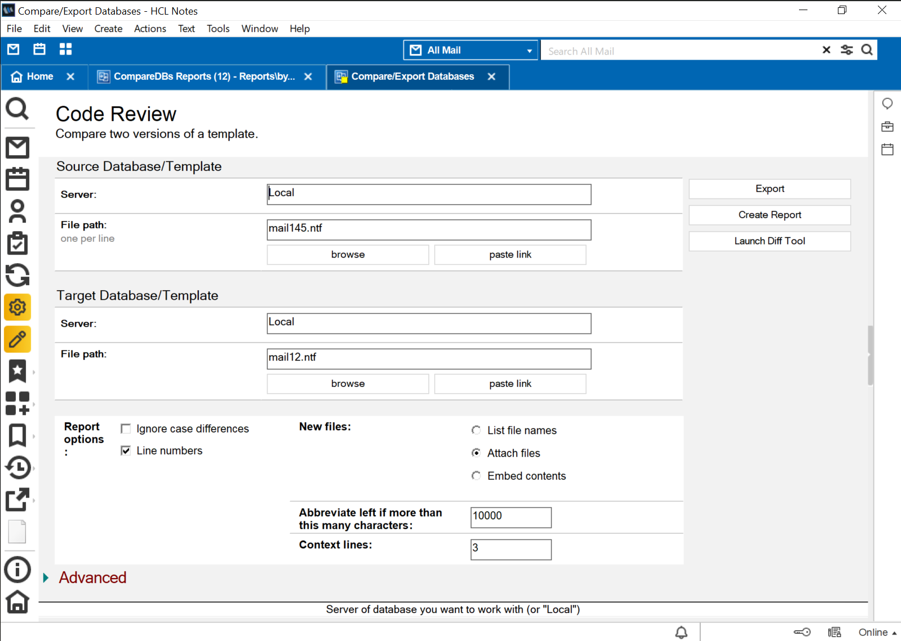

<h1>HCL Domino CompareDBs Template</h1>

  

    Table of contents
  

  {: .text-delta }
1. TOC
{:toc}

## Info

Property | Value
---|---
Filename | comparedbs.ntf 
Templatename | HCL Compare DBs
Template version | 12.0.2
Signed by | Open Source Template/Domino Development
Optimized for | Notes Client 

## What does this application do?

CompareDBs Reports (comparedbs.ntf), installed on the Domino server, can be used to compare two database designs and/or document contents or to analyze the design of one database.
Database comparison You can compare the design of two Notes databases or templates and generate a report that is saved in the database. Some of the options include the ability to:

* Exclude documents from the comparison.
* Integrate the reports that are generated with source control applications such as Git or Jira.
* Use a diff tool of your choice rather than the built-in tabular report that shows differences between source and target.

Database design synopsis You can use the tool to generate a design synopsis of a database that is exported to another database. The target database contains documents describing each design element.

A second template. designsynopsis.ntf, is used to organize and display the design synopsis output as a searchable Notes application.

For complete information on all options and how to get started, use the template to create a new Notes application. (It's an advanced template). Then open the application and select Help > > About This Application and Help > > Using This Application .

## Initial Setup and Configuration

see [Setup](setup.md)

## Using 

see [Using](using.md)